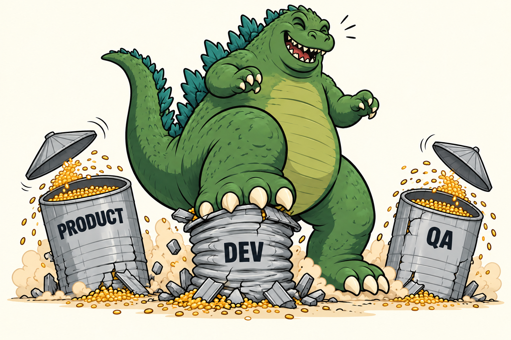
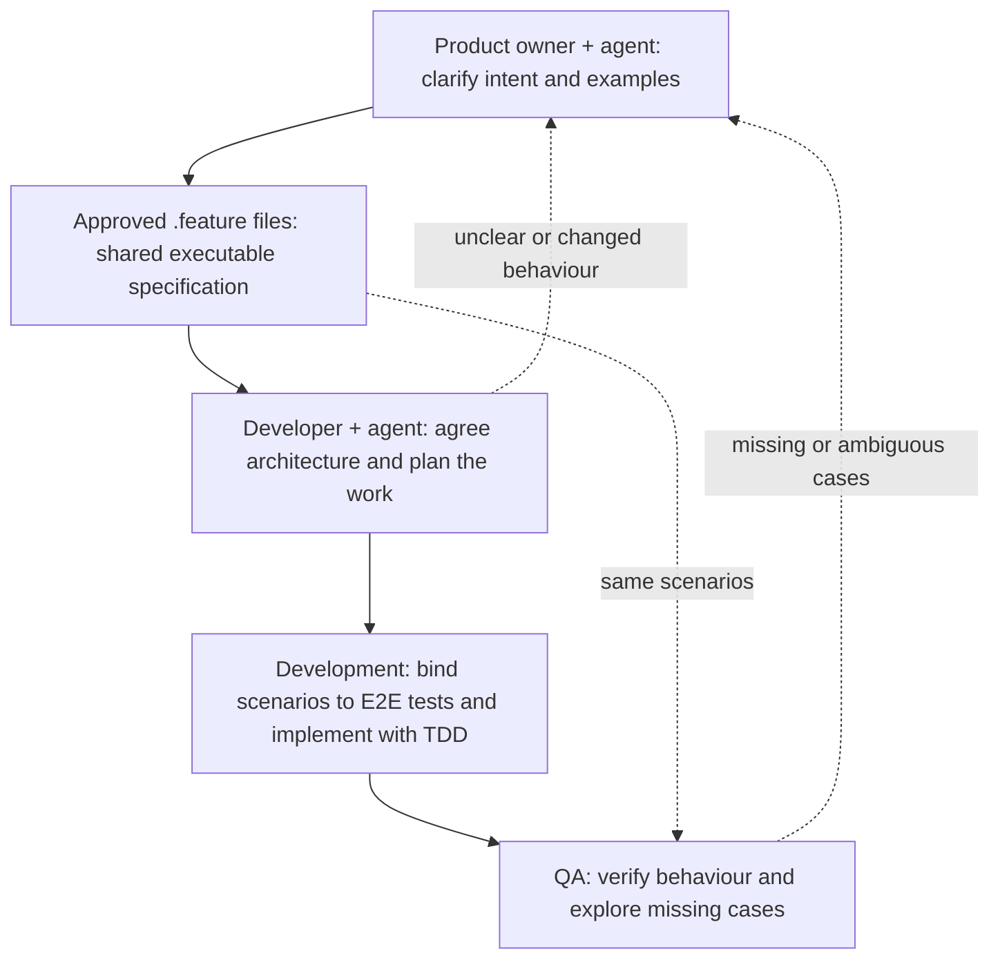

# Shared product, development and QA workspace



A thin framework over [Matt Pocock Skills](https://github.com/mattpocock/skills) that keeps product owners, developers and QA aligned through shared domain language and approved `.feature` scenarios. Scenarios become executable E2E specifications; code and ADRs preserve implementation and architectural decisions. This template adds collaboration and simplicity rules to the skills' engineering workflows.

**Dependencies:** Git, `tree`, an agent supporting Matt Pocock Skills, and the engineering skills used by this framework. Node.js/npm is needed for the installer below; the application stack and scenario runner are chosen per project.

## How it works

Product, development and QA often keep separate descriptions of the same feature. Intent gets lost in handoffs, domain terms drift, and tests can end up checking something different from what the product owner meant. SiloZilla gives all three roles one shared workspace: a common domain language and approved `.feature` files that preserve both the intent and the examples of expected behaviour.



1. **Agree the behaviour.** The agent grills the product owner about who needs the feature, why, its scope and concrete examples. Capture shared terms through domain modeling and get the owner's approval of the `.feature` scenarios.
2. **Plan the implementation.** Grill the developer against those scenarios: architecture, testable public interfaces and task breakdown. After both discussions, use `to-spec` for the temporary Markdown plan and `to-tickets` for tasks linked to the approved scenarios. Review before publishing.
3. **Make the agreement executable.** Use `tdd` to connect scenarios to the product through step bindings, then implement until the E2E tests pass. Tests exercise observable product behaviour through UI, CLI or external API. Unit tests need explicit user approval for their scope.
4. **Verify and refine.** QA reads the original intent and runs the same scenarios, then explores gaps. Missing, ambiguous or changed behaviour goes back to the product owner for agreement before scenarios change.

The lasting specification stays in `features/<capability>/<slug>.feature`, versioned with the code. Feature descriptions preserve the product intent, `CONTEXT.md` preserves domain vocabulary, and ADRs preserve qualifying architectural decisions. Before temporary plans or tickets are deleted at feature merge, check that this lasting context is complete.


## Agent instructions: initialize a new project

When asked to initialize a project from this template:

1. Work in the target project directory. Copy `AGENTS.md` and `docs/` from the template if needed, preserving existing project instructions. Read `AGENTS.md` and use `tree docs` to discover relevant guidance
2. Initialize Git if the target is not already a repository, following the branch policy in [about-project.md](docs/about-project.md)
3. Check which required skills are available to the active agent. Install missing Matt Pocock engineering skills, including `setup-matt-pocock-skills` and their supporting skills:

   ```sh
   npx skills@latest add mattpocock/skills
   ```

   Follow the [upstream installation instructions](https://github.com/mattpocock/skills#installation-30-second-setup) for the active agent and select the skills referenced by the project documents
4. Run `/setup-matt-pocock-skills` once in the target project and follow its instructions. It generates tracker, domain and applicable triage configuration under `docs/agents/`. These files belong to the initialized project and are intentionally absent from the reusable template
5. Agree the project purpose, stack and scenario runner with the user. Fill in [about-project.md](docs/about-project.md) with those decisions and actual commands; identify anything not yet available instead of inventing it
6. Verify that required skills are available, generated configuration exists and documented commands work where the project supports them. Report unresolved setup items, then use the [feature workflow](docs/how-to-write-specs.md) for product work

## Sources and acknowledgements

- [Matt Pocock Skills](https://github.com/mattpocock/skills) supplies the engineering workflows this framework builds on
- [FerroxLabs/agents-md](https://github.com/FerroxLabs/agents-md) containing valuable instructions, copyright Sean Donahoe
- [Karpathy-inspired coding guidelines](https://github.com/multica-ai/andrej-karpathy-skills), for simplicity and surgical-changes rules
- [Rinat Abdullin’s materials](https://abdullin.com/) are the source of the `AICODE-` convention, executable specs and many others the repo

